```python
import pandas as pd
import numpy as np
import scipy.stats as stats
from scipy.stats import bernoulli
```

## Bernoulli
La distribución de Bernoulli es un modelo teórico utilizado para representar una variable aleatoria discreta la cual solo puede resultar en dos sucesos mutuamente excluyentes. 

Un experimento de Bernoulli se caracteriza por tener solo dos resultados. ... De este modo, en otras palabras, la distribución binomial se define como una serie de experimentos o ensayos en los que solo podemos tener 2 posibles resultados (éxito o fracaso), siendo el éxito la variable aleatoria.


```python
universo = ['cara','sello']
p_cara = 1/2

bernoulli.rvs(p=p_cara) #rvs = Random variable sample
```


    0


```python
universo[bernoulli.rvs(p=p_cara)]
```


    'cara'


```python
bernoulli.rvs(p=p_cara, size=10) 
```


    array([0, 0, 1, 1, 0, 1, 1, 1, 1, 1])


```python
sum(bernoulli.rvs(p=p_cara, size=10) )
```


    3


```python
# Al hacer diferentes experimentos como en la linea de arriba
# Llegamos a la distribucion binomial de n experimentos
from scipy.stats import binom
binom.rvs(p=p_cara, n=10, size=100)
```


    array([4, 4, 6, 6, 3, 4, 7, 6, 6, 5, 6, 3, 6, 6, 6, 3, 5, 8, 5, 4, 4, 4,
           5, 3, 7, 8, 4, 6, 5, 6, 4, 7, 6, 5, 1, 6, 5, 6, 6, 7, 5, 3, 6, 7,
           4, 5, 6, 4, 3, 4, 1, 4, 4, 3, 4, 6, 7, 7, 7, 6, 5, 3, 1, 5, 5, 3,
           6, 6, 3, 4, 6, 5, 7, 0, 3, 7, 3, 5, 7, 5, 2, 7, 5, 5, 6, 5, 5, 4,
           5, 6, 5, 5, 4, 4, 2, 4, 3, 4, 5, 2])


Concepto de distribucion de probabilidad: Algunos valores sucederan con mayor frecuencia de otros.


```python
import pandas as pd
pd.Series(binom.rvs(p=p_cara, n=10, size=100)).value_counts()/100
```


    5    0.25
    4    0.20
    3    0.18
    6    0.18
    7    0.08
    2    0.06
    8    0.02
    9    0.02
    1    0.01
    dtype: float64


## Medidas de tendencia central


```python
import scipy
import scipy.stats
```


```python
df = pd.read_csv('bicicletas-compartidas.csv')
```


```python
df.shape
```


    (17414, 10)


```python
df.columns
```


    Index(['fecha', 'bicis-compartidas', 'temp-obs', 'sens-temp', 'hum', 'viento',
           'codigo-clima', 'festivo', 'findesemana', 'cuartil-ano'],
          dtype='object')


```python
y = df['bicis-compartidas'].values
```


```python
y
```


    array([182, 138, 134, ..., 337, 224, 139])


```python
y = np.where(y==0, 1, y)
```


```python
np.min(y)
```


    1


```python
np.max(y)
```


    7860


```python
np.mean(y)
```


    1143.1016997817849


```python
np.median(y)
```


    844.0


```python
np.sum(y)
```


    19905973


```python
scipy.stats.mstats.hmean(y) #Media armonica
```


    241.65180305136826


### Tipos de media
1. Media armonica:  fórmula de la media armónica (H) de un conjunto de números x1, x2, x3, …, xn, es la siguiente:

La media armónica es la recíproca de la media aritmética. Los elementos del conjunto deben ser necesariamente no nulos. Esta media es poco sensible a los valores grandes y los infravalora respecto a la media aritmética, pero muy sensible a los valores próximos a cero, ya que los recíprocos 1/Xi son muy altos, por lo que les da más peso que en las medias aritmética y geométrica. Si algún valor fuese cero, la media armónica quedaría indeterminada.

2. Medie geometrica: La media geométrica (MG) de un conjunto de números estrictamente positivos (X1, X2,…,XN) es la raíz N-ésima del producto de los N elementos.


3. Media aritmetica: Convencional.


```python
np.median(y)
```


    844.0


#### Calculando la moda


```python
#Para calcular la moda
#moda = valor de y con la maxima frecuencia

moda = np.nan

valores, conteo_valores = np.unique(y, return_counts=True)
pos = np.argmax(conteo_valores)
moda = valores[pos]
print(moda)
```

    46


```python
np.std(y)
```


    1085.0768508213835


## Revisiones


```python
y_alterado = y.copy()
y_alterado[y_alterado==max(y_alterado)] = 10000000
```


```python
print(np.mean(y_alterado))
```

    1716.9009417709888


```python
print( np.mean(y))
```

    1143.1016997817849


```python
print(np.median(y))
```

    844.0


```python
print(np.median(y_alterado))
```

    844.0


## Diagramas de frecuencias para variables continuas y discretas
Representaciones de categorias o numeros que puede tomar una variable aleatoria.


* Variables categoricas: Tablas de frecuencias
* Variables numericas: Percenntiles, deciles, quintiles, cuartiles, outliers o valores extremos


```python
df = pd.read_csv('bicicletas-compartidas.csv')
```


```python
#Frecuencias para variables categoricas
ycat = df['cuartil-ano']
ycat = ycat.apply(lambda x:  'Cat-' + str(int(x)) )
ycat.head(5)
```


    0    Cat-3
    1    Cat-3
    2    Cat-3
    3    Cat-3
    4    Cat-3
    Name: cuartil-ano, dtype: object


```python
valores, conteo_freq = np.unique(ycat, return_counts = True)
```


```python
valores
```


    array(['Cat-0', 'Cat-1', 'Cat-2', 'Cat-3'], dtype=object)


```python
conteo_freq
```


    array([4394, 4387, 4303, 4330])


```python
tabla_frequencias = dict(zip(valores, conteo_freq))
```


```python
tabla_frequencias
```


    {'Cat-0': 4394, 'Cat-1': 4387, 'Cat-2': 4303, 'Cat-3': 4330}


```python
# variable numerica
ynum = df['viento'].copy()
```


```python
np.min(ynum), np.max(ynum)
```


    (0.0, 56.5)


```python
np.percentile(ynum, q=100)
np.percentile(ynum, q=50)
```


    15.0


```python
np.percentile(ynum, q=25)
```


    10.0


```python
valores = [0,25,50,75,100]
np.percentile(ynum, q=valores)
```


    array([ 0. , 10. , 15. , 20.5, 56.5])


```python
deciles = list(range(0,110,10))
np.percentile(ynum, q=deciles)
```


    array([ 0. ,  6.5,  9. , 11. , 13. , 15. , 17. , 19.5, 22. , 27. , 56.5])


```python
y = pd.DataFrame(y)
y.describe()
```


<div>
<style scoped>
    .dataframe tbody tr th:only-of-type {
        vertical-align: middle;
    }

    .dataframe tbody tr th {
        vertical-align: top;
    }

    .dataframe thead th {
        text-align: right;
    }
</style>
<table border="1" class="dataframe">
  <thead>
    <tr style="text-align: right;">
      <th></th>
      <th>0</th>
    </tr>
  </thead>
  <tbody>
    <tr>
      <th>count</th>
      <td>17414.000000</td>
    </tr>
    <tr>
      <th>mean</th>
      <td>1143.101700</td>
    </tr>
    <tr>
      <th>std</th>
      <td>1085.108007</td>
    </tr>
    <tr>
      <th>min</th>
      <td>1.000000</td>
    </tr>
    <tr>
      <th>25%</th>
      <td>257.000000</td>
    </tr>
    <tr>
      <th>50%</th>
      <td>844.000000</td>
    </tr>
    <tr>
      <th>75%</th>
      <td>1671.750000</td>
    </tr>
    <tr>
      <th>max</th>
      <td>7860.000000</td>
    </tr>
  </tbody>
</table>
</div>


```python
#Outlier Identificar
Q1 = np.percentile(ynum, q=25)
Q3 = np.percentile(ynum, q=75)

RI = Q3 - Q1

lim_inf = Q1 - 1.5*RI
lim_sup = Q3 + 1.5*RI
print(lim_inf)
print(lim_sup)
```

    -5.75
    36.25


```python
import matplotlib.pyplot as plt
%matplotlib inline

plt.hist(ynum)
```


    (array([1100., 4559., 4198., 4285., 1985.,  868.,  300.,   86.,   27.,
               6.]),
     array([ 0.  ,  5.65, 11.3 , 16.95, 22.6 , 28.25, 33.9 , 39.55, 45.2 ,
            50.85, 56.5 ]),
     <BarContainer object of 10 artists>)


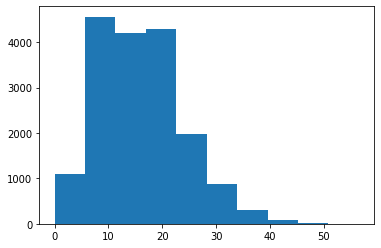


## Visualizacion de datos 


```python
import seaborn as sns
```


```python
df = pd.read_csv('bicicletas-compartidas.csv')
```

### Categoricas


```python
y = df['cuartil-ano'].apply(lambda x: 'cuartil'+str(x))
```


```python
df.columns
```


    Index(['fecha', 'bicis-compartidas', 'temp-obs', 'sens-temp', 'hum', 'viento',
           'codigo-clima', 'festivo', 'findesemana', 'cuartil-ano'],
          dtype='object')


```python
fig, ax = plt.subplots()
ax.bar(y.value_counts().index, y.value_counts())
ax.set_xlabel('Cuartiles del year')
ax.set_ylabel('Frecuencia')
```


    Text(0, 0.5, 'Frecuencia')


```python
fig, ax = plt.subplots()
ax.bar(y.value_counts().index, y.value_counts())
ax.set_xlabel('Cuartiles del year')
ax.set_ylabel('Frecuencia')
ax.patches[2].set_facecolor('red')
```


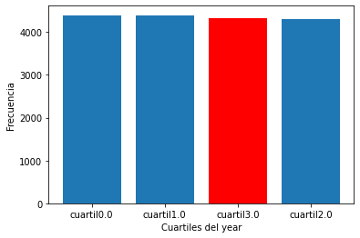


```python
fig, ax = plt.subplots()
ax.pie(y.value_counts(), labels= y.value_counts().index)
ax.set_title('Diagrama de pie')
```


    Text(0.5, 1.0, 'Diagrama de pie')


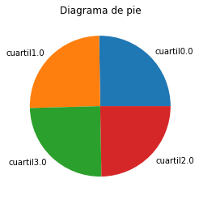


### Numericas


```python
y = df['viento']
```


```python
fig, ax = plt.subplots()
ax.hist(y, bins=30)
ax.set_xlabel('Viento')
ax.set_ylabel('Frecuencia')
ax.axvline(np.mean(y), c='r', linestyle='--', label='Promedio')
ax.axvline(np.mean(y)+np.std(y), c='g', linestyle='--', label='+1 Std')
ax.axvline(np.mean(y)-np.std(y), c='g', linestyle='--', label='-1 Std')
ax.legend()
```


    <matplotlib.legend.Legend at 0x7f49814b5898>


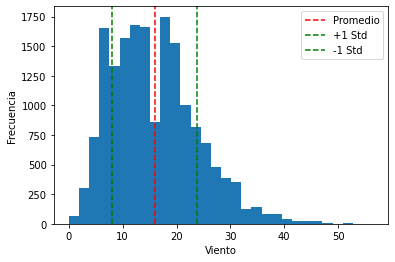


## Boxplot y Scatterplot


```python
y = df['bicis-compartidas']

fig, ax = plt.subplots()

ax.boxplot(x=y)
```


    {'whiskers': [<matplotlib.lines.Line2D at 0x7f49811a45c0>,
      <matplotlib.lines.Line2D at 0x7f49811a4860>],
     'caps': [<matplotlib.lines.Line2D at 0x7f49811a4b38>,
      <matplotlib.lines.Line2D at 0x7f49811a4e10>],
     'boxes': [<matplotlib.lines.Line2D at 0x7f49811a42e8>],
     'medians': [<matplotlib.lines.Line2D at 0x7f49811b5128>],
     'fliers': [<matplotlib.lines.Line2D at 0x7f49811b5400>],
     'means': []}


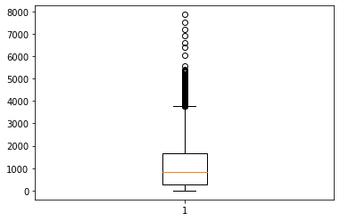


```python
fig, ax = plt.subplots()

sns.boxplot(x='cuartil-ano',y='bicis-compartidas',data=df)
```


    <AxesSubplot:xlabel='cuartil-ano', ylabel='bicis-compartidas'>


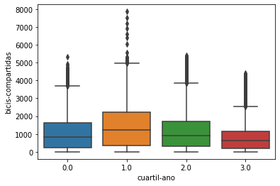


```python
fig, ax = plt.subplots()
ax.scatter(df['viento'], df['bicis-compartidas'], alpha= 0.03)
ax.set_title('Distribucion conjunta viento y bicis compartidas')
ax.set_xlabel('Viento')
ax.set_ylabel('Bicis compartidas')
```


    Text(0, 0.5, 'Bicis compartidas')


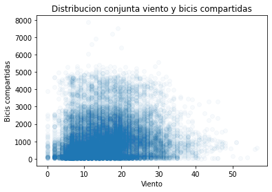


## Teorema de Bayes: Inferir la probabilidad de A al estar condicionado a B

* Probabilidad UNI VARIADA
* Probabilidad CONJUNTA BI VARIADA
* Probabilidad Condicional


```python
df = pd.read_csv('juego-azar.csv', sep=';')

```


```python
df.numero.value_counts() / len(df)
```


    1    0.4
    2    0.3
    3    0.3
    Name: numero, dtype: float64


```python
df.color.value_counts()
```


    negro     6
    blanco    4
    Name: color, dtype: int64


```python
df.groupby(['color','numero']).size()
```


    color   numero
    blanco  1         1
            2         1
            3         2
    negro   1         3
            2         2
            3         1
    dtype: int64


```python
df.groupby(['color','numero']).size()/len(df)
```


    color   numero
    blanco  1         0.1
            2         0.1
            3         0.2
    negro   1         0.3
            2         0.2
            3         0.1
    dtype: float64


Probabilidad condicional: UN evento A dado B

 P(A|B) = P(Blanca|2)
 
 
NUmero de esferas blancas con el numero 2 es 1 y el numero total de esferas con el numero 2 son 3:


 P(A|B) = 1/3


```python
#p_blanca = 4/10
```

## Funciones de distribucion discreta y continua

Distribuciones discretas:  
* Rango: Debe contener todos los valores de x
* Probabilidad: NO debe superar 1
* Probabilidad acumulada: Suma de las probabilidades de tener un valor igual o menor a cualquier xi
* Regla de completitud del espacio: La suma de todas las probabilidades de los valores de xi tiene que sumar 1.
* Valor esperado: Promedio
* Varianza

Distribuciones continuas:
* Lo mismo que arriba pero con formulas de densidad continua.


```python
from scipy.stats import binom
```


```python
p = 0.3
n = 8
x = list(range(0,9,1))
y = list([])
```


```python
for i in x:
    y.append(binom.pmf(i, p=p, n=n))
```


```python
y
```


    [0.05764801000000002,
     0.1976503200000001,
     0.2964754800000002,
     0.25412184,
     0.1361367,
     0.04667544000000001,
     0.010001879999999989,
     0.0012247199999999988,
     6.560999999999994e-05]


#### Probability Mass Function O funcion de densidad de probabilidad:
En la teoría de la probabilidad, la función de densidad de probabilidad, función de densidad, o simplemente densidad de una variable aleatoria continua describe la probabilidad relativa según la cual dicha variable aleatoria tomará determinado valor.
La probabilidad de que la 


```python
fig, ax = plt.subplots()
ax.bar(x,y)
ax.set_ylabel('Probabilidad discreta')
```


    Text(0, 0.5, 'Probabilidad discreta')


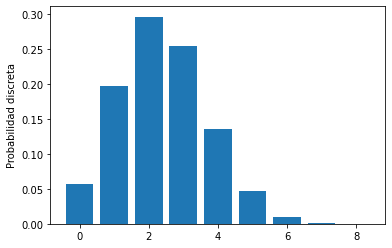


```python
np.sum(y)
```


    1.0000000000000002


```python
media = np.average(x, weights=y) #Promedio ponderado por la probabilidad de cada xi
varianza = np.average( ((x-media)**2), weights=y)

media, varianza

fig, ax = plt.subplots()
ax.bar(x,y)
ax.set_ylabel('Probabilidad discreta')
ax.axvline(x=media, c='r', linestyle='--', label='valor esperado')
ax.axvline(x = media  + 3*np.sqrt(varianza), c='k', linestyle='--', label='3*Std')
ax.legend()
```


    <matplotlib.legend.Legend at 0x7f49811642e8>


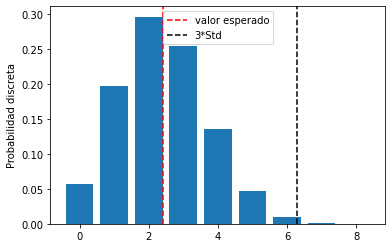


## Funciones de distribucion discreta y continua


```python
N = 100
x = list(range(1,N+1,1))
y = list([])

for i in x:
    y.append(binom.pmf(i, p=0.3, n=N))
```


```python
y
```


    [1.3862042184105933e-14,
     2.9407332347710807e-13,
     4.117026528679382e-12,
     4.278766856591813e-11,
     3.5208138705672277e-10,
     2.389123697884838e-09,
     1.37496506694588e-08,
     6.850272387105447e-08,
     3.001071712446251e-07,
     1.1704179678540456e-06,
     4.104063004163861e-06,
     1.3045057406091572e-05,
     3.784500170558246e-05,
     0.00010079128005262849,
     0.0002476585738436032,
     0.000563865502947482,
     0.0011940681238887599,
     0.0023597060543514643,
     0.00436456909301092,
     0.007575644925726078,
     0.012368399878738114,
     0.019034485527667042,
     0.027665028655117337,
     0.038039414400788354,
     0.04955992276217045,
     0.061269135282903536,
     0.07196692080848441,
     0.08041201865846266,
     0.08556155679915357,
     0.08678386475342778,
     0.08398438524524879,
     0.07761057029360002,
     0.06853920493460677,
     0.057883950385953564,
     0.04677968235272963,
     0.03619856372532685,
     0.026834456506805493,
     0.019066587517993245,
     0.012990422265006426,
     0.008490168837485806,
     0.005324844567064698,
     0.0032057737699674217,
     0.0018531715480874773,
     0.0010288712166329898,
     0.0005487313155375643,
     0.0002811821958500107,
     0.000138454455099392,
     6.55186260738213e-05,
     2.9798558797423272e-05,
     1.3026227131445298e-05,
     5.473204677077736e-06,
     2.2103326580506156e-06,
     8.579188753619353e-07,
     3.2001735826994016e-07,
     1.147075206266218e-07,
     3.9503865521925166e-08,
     1.3068947992215872e-08,
     4.1524489926005945e-09,
     1.2668488452002281e-09,
     3.710057332371766e-10,
     1.0426390629616922e-10,
     2.8108011605188348e-11,
     7.26601660542293e-12,
     1.8002853642900753e-12,
     4.273204820732424e-13,
     9.711829138028295e-14,
     2.1121675310848908e-14,
     4.3929534785169706e-15,
     8.731336106369137e-16,
     1.657171954882398e-16,
     3.000915008841319e-17,
     5.180150908118919e-18,
     8.515316561291009e-19,
     1.3315456398930993e-19,
     1.9782963792697214e-20,
     2.7889516625043152e-21,
     3.725501293140944e-22,
     4.7080510847388074e-23,
     5.619012144534894e-24,
     6.3213886626009865e-25,
     6.689300172064472e-26,
     6.642684839855114e-27,
     6.173923947542075e-28,
     5.354934036133559e-29,
     4.319946785452303e-30,
     3.2291961020823153e-31,
     2.2270317945393726e-32,
     1.4099714283610392e-33,
     8.147507451203865e-35,
     4.26774199824933e-36,
     2.0099255878724807e-37,
     8.426706657229357e-39,
     3.1066199657987784e-40,
     9.914744571698849e-42,
     2.683690260008763e-43,
     5.990380044661983e-45,
     1.0586827766707475e-46,
     1.388942418372733e-48,
     1.2025475483746612e-50,
     5.153775207320016e-53]


```python
fig, ax = plt.subplots()

ax.plot(x, y)
ax.set_title('Probabilidad continua')
```


    Text(0.5, 1.0, 'Probabilidad continua')


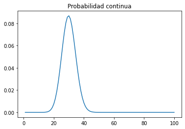


Funcion de probabilidad acumulada: La probabilidad de  determinado valor mas la probabilidad de los valores menores.


```python
N = 100
x = list(range(1,N+1,1))
y = list([])

for i in x:
    y.append(binom.cdf(i, p=0.3, n=N))
fig, ax = plt.subplots()

ax.plot(x, y)
ax.set_title('Probabilidad continua')
```


    Text(0.5, 1.0, 'Probabilidad continua')


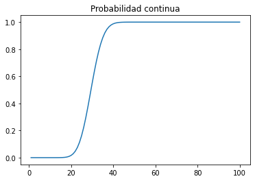


```python
from scipy.stats import norm
mean, var, skew, kurt = norm.stats(moments = 'mvsk')
print(mean, var, skew, kurt)
```

    0.0 1.0 0.0 0.0


#### Asimetria

Coeficiente de asimetría basado en momentos
También conocido como el coeficiente de asimetría de Fisher-Pearson, se basa en momentos centrales:

asimetría=m3S3
Donde S3 es la desviación típica elevada al cubo y mr es lo que se conoce como el Momento central de orden r, donde r puede ser cualquier entero positivo y se calcula se la siguiente manera.

mr=1n∗∑i=1n(xi−X¯)r

Interpretación:

asimetría=0: Distribución simétrica

asimetría>0: Distribución asimétrica a la derecha

asimetría<0: Distribución asimétrica a la izquierda

#### Kurtosis

Kurtosis
Otra medida que se utiliza para describir la forma de la distribución es la kurtósis o curtósis. Esta utiliza el moomento central estandarizado de orden 4 para detectar valores extremos. En presencia de valores extremos, la forma de la distribución parece más puntiaguda; por esto la kurtósis se conoce como una medida del apuntalamiento de la distribución.

Dada una muestra x1,x2,...,xn, la kurtósis se calcula como

m4/S4

Este valor lo comparamos con 3, y dependiendo de ello, decimos que la distribución es Platicúrtica, Mesocúrtica o Leptocúrtica:

Si kurtosis<3 la distribución es Platicúrtica

Si kurtosis=3 la distribución es Mesocúrtica

Si kurtosis>3 la distribución es Leptocúrtica


Al igual que con la asimetría basada en momentos, podemos llegar a una expresión basada en los datos estandarizados.

m4S4=1n∗∑i=1n(x1−X¯S)4=1n∗∑i=1nz4i


## Distribuciones de mayor aplicacion discretas

1. Bernoulli: Experimento binario asociado a exito o fracaso.
2. Binomial: Numero de exitos x en N ensayos.
3. Geometrica: Numero de ensayos x hasta 1 exito.
4. Binomial Negativa: Numero de ensayos x hasta en k-esimo exito.
5. Poisson: Numero de llegadas en N a una longitud de tiempo t

#### Bernoulli


```python
import matplotlib as plt
%matplotlib inline
from scipy.stats import bernoulli
import seaborn as sns

p = 0.3
data = bernoulli.rvs(p, size=100)
len(data)
```


    100


```python
mean, var, skew, kurt = bernoulli.stats(p, moments='mvsk')
mean, var, skew, kurt
```


    (array(0.3), array(0.21), array(0.87287156), array(-1.23809524))


```python
ax = sns.distplot(data, bins=30, kde=False, color='blue')
ax.set(xlabel='Distribucion de Bernoulli', ylabel='Frecuencia')
ax.axvline(x=mean, linestyle='--',label='Media')
ax.legend()
```

    /home/jp/snap/jupyter/common/lib/python3.7/site-packages/seaborn/distributions.py:2557: FutureWarning: `distplot` is a deprecated function and will be removed in a future version. Please adapt your code to use either `displot` (a figure-level function with similar flexibility) or `histplot` (an axes-level function for histograms).
      warnings.warn(msg, FutureWarning)


    <matplotlib.legend.Legend at 0x7f4980f03400>


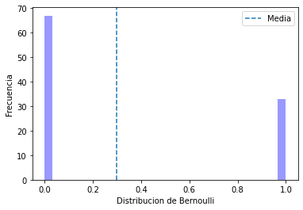


#### Binomial


```python
import matplotlib as plt
%matplotlib inline
from scipy.stats import binom
import seaborn as sns

n=10
p = 0.3
data = binom.rvs(p=p,n=n, size=100)
len(data)

mean, var, skew, kurt = binom.stats(p=p,n=n, moments='mvsk')
mean, var, skew, kurt
```


    (array(3.), array(2.1), array(0.27602622), array(-0.12380952))


```python
ax = sns.distplot(data, bins=30, kde=False, color='blue')
ax.set(xlabel='Distribucion de Binomial', ylabel='Frecuencia')
ax.axvline(x=mean, linestyle='--',label='Media')
ax.legend()
```


    <matplotlib.legend.Legend at 0x7f4980ede828>


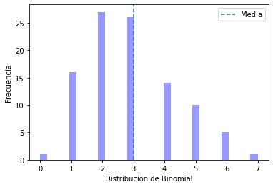


#### Binomial Geometrica


```python
import matplotlib as plt
%matplotlib inline
from scipy.stats import nbinom
import seaborn as sns

n=1
p = 0.3
data = nbinom.rvs(p=p,n=n, size=100)
len(data)

mean, var, skew, kurt = nbinom.stats(p=p,n=n, moments='mvsk')
mean, var, skew, kurt
```


    (array(2.33333333), array(7.77777778), array(2.03188864), array(6.12857143))


```python

ax = sns.distplot(data, bins=30, kde=False, color='blue')
ax.set(xlabel='Distribucion de Geometrica', ylabel='Frecuencia')
ax.axvline(x=mean, linestyle='--',label='Media')
ax.legend()

```


    <matplotlib.legend.Legend at 0x7f4980dcd780>


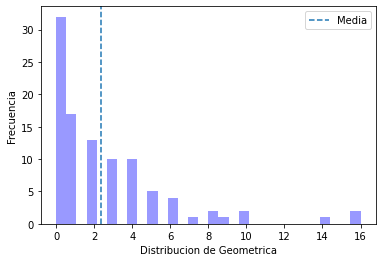


#### Binomial Negativa


```python
import matplotlib as plt
%matplotlib inline
from scipy.stats import nbinom
import seaborn as sns

n=100
p = 0.3
data = nbinom.rvs(p=p,n=n, size=100)
len(data)

mean, var, skew, kurt = nbinom.stats(p=p,n=n, moments='mvsk')
mean, var, skew, kurt
```


    (array(233.33333333),
     array(777.77777778),
     array(0.20318886),
     array(0.06128571))


```python

ax = sns.distplot(data, bins=30, kde=False, color='blue')
ax.set(xlabel='Distribucion de Binomial Negativa', ylabel='Frecuencia')
ax.axvline(x=mean, linestyle='--',label='Media')
ax.legend()
```


    <matplotlib.legend.Legend at 0x7f4980cd9b00>


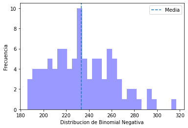


#### Poisson


```python
import matplotlib as plt
%matplotlib inline
from scipy.stats import poisson
import seaborn as sns

lambda_p = 3
data = poisson.rvs(mu=lambda_p, size=100)
len(data)

mean, var, skew, kurt = poisson.stats(mu=lambda_p,moments='mvsk')
mean, var, skew, kurt
```


    (array(3.), array(3.), array(0.57735027), array(0.33333333))


```python

ax = sns.distplot(data, bins=30, kde=False, color='blue')
ax.set(xlabel='Distribucion de Poisson', ylabel='Frecuencia')
ax.axvline(x=mean, linestyle='--',label='Media')
ax.legend()
```


    <matplotlib.legend.Legend at 0x7f4980ba9080>


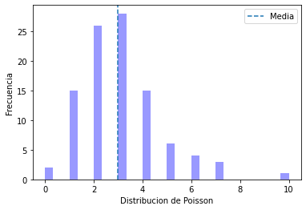


## Distribuciones de mayor aplicacion continuas

1. Distribucion Exponencial
2. Distribucion Normal
3. Distribucion Uniforme


```python
import matplotlib as plt
%matplotlib inline
from scipy.stats import expon
import seaborn as sns

data = expon.rvs(size=100000)
len(data)

mean, var, skew, kurt = expon.stats(moments='mvsk')
mean, var, skew, kurt
```


    (array(1.), array(1.), array(2.), array(6.))


```python
ax = sns.distplot(data, bins=500, kde=False, color='blue')
ax.set(xlabel='Distribucion de Exponencial', ylabel='Frecuencia')
ax.axvline(x=mean, linestyle='--',label='Media')
ax.legend()
```


    <matplotlib.legend.Legend at 0x7f4980c4e978>


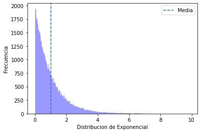


```python
from scipy.stats import norm
import seaborn as sns

data = norm.rvs(size=100000)
len(data)

mean, var, skew, kurt = norm.stats(moments='mvsk')
mean, var, skew, kurt
```


    (array(0.), array(1.), array(0.), array(0.))


```python
ax = sns.distplot(data, bins=500, kde=False, color='blue')
ax.set(xlabel='Distribucion de Normal Estandar Var1 Media0', ylabel='Frecuencia')
ax.axvline(x=mean, linestyle='--',label='Media')
ax.legend()
```


    <matplotlib.legend.Legend at 0x7f49806d3c88>


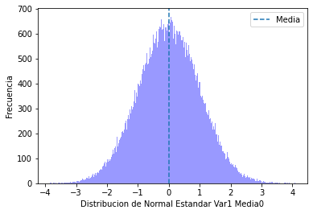


```python
from scipy.stats import uniform
import seaborn as sns

data = uniform.rvs(size=100000)
len(data)

mean, var, skew, kurt = uniform.stats(moments='mvsk')
mean, var, skew, kurt
```


    (array(0.5), array(0.08333333), array(0.), array(-1.2))


```python
ax = sns.distplot(data, bins=500, kde=False, color='blue')
ax.set(xlabel='Distribucion de Uniforme', ylabel='Frecuencia')
ax.axvline(x=mean, linestyle='--',label='Media')
ax.legend()
```


    <matplotlib.legend.Legend at 0x7f4980206470>


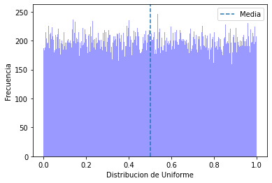


## Estandarizacion, covarianza y correlacion

* Estandarizar una variable implica restar su media y dividir sobre su desviacion estandar, lo que se conoce como centrar y reducir en el orden anterior.
El resultado de la aplicacion de la estandarizacion es una Variable Aleatoria Z con valor esperado 0 y std .
* Covarianza y correlacion: Mediran el valor lineal de la relacion xy, a diferencia de la correlacion la covarianza nos hablara de la direccion de la relacion xy, la correlacion nos da la direccion y la fuerza que tiene la relacion xy.


```python
import numpy as np
import pandas as pd
import matplotlib.pyplot as plt
import seaborn as sns

%matplotlib inline
```


```python
df = pd.read_csv('iris-data.csv', index_col=0)
```


```python
df.columns
```


    Index(['lar.sepalo', 'anc.sepalo', 'lar.petalo', 'anc.petalo', 'tipo_flor'], dtype='object')


```python
df.tipo_flor.value_counts()
```


    0.0    50
    2.0    50
    1.0    50
    Name: tipo_flor, dtype: int64


```python
y = df['lar.petalo']
```


```python
fig, ax = plt.subplots()
ax.set_title('Variable Originial')
ax.hist(y, bins=30)
ax.axvline(x=np.mean(y), c='k', label='Media', linestyle='--')
ax.axvline(x=np.mean(y)+np.std(y), c='r', label='Std', linestyle='--')
ax.axvline(x=np.mean(y)-np.std(y), c='r', label='Std', linestyle='--')
ax.legend()
```


    <matplotlib.legend.Legend at 0x7f497bcac470>


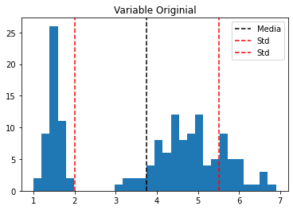


```python
#Calcular covarianza
fig, ax = plt.subplots()
ax.scatter(df['lar.petalo'],df['lar.sepalo'], alpha=0.7)
ax.autoscale()
```


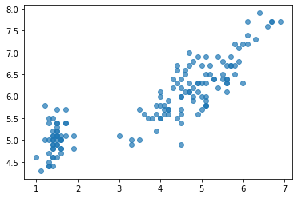


```python
np.cov(df['lar.petalo'], df['lar.sepalo']) #Sabemos por la segunda columna del first row y la primera columna del second row la covarianza positiva de 1.27 que tienen las variables
```


    array([[3.11627785, 1.27431544],
           [1.27431544, 0.68569351]])


```python
df.corr()
```


<div>
<style scoped>
    .dataframe tbody tr th:only-of-type {
        vertical-align: middle;
    }

    .dataframe tbody tr th {
        vertical-align: top;
    }

    .dataframe thead th {
        text-align: right;
    }
</style>
<table border="1" class="dataframe">
  <thead>
    <tr style="text-align: right;">
      <th></th>
      <th>lar.sepalo</th>
      <th>anc.sepalo</th>
      <th>lar.petalo</th>
      <th>anc.petalo</th>
      <th>tipo_flor</th>
    </tr>
  </thead>
  <tbody>
    <tr>
      <th>lar.sepalo</th>
      <td>1.000000</td>
      <td>-0.117570</td>
      <td>0.871754</td>
      <td>0.817941</td>
      <td>0.782561</td>
    </tr>
    <tr>
      <th>anc.sepalo</th>
      <td>-0.117570</td>
      <td>1.000000</td>
      <td>-0.428440</td>
      <td>-0.366126</td>
      <td>-0.426658</td>
    </tr>
    <tr>
      <th>lar.petalo</th>
      <td>0.871754</td>
      <td>-0.428440</td>
      <td>1.000000</td>
      <td>0.962865</td>
      <td>0.949035</td>
    </tr>
    <tr>
      <th>anc.petalo</th>
      <td>0.817941</td>
      <td>-0.366126</td>
      <td>0.962865</td>
      <td>1.000000</td>
      <td>0.956547</td>
    </tr>
    <tr>
      <th>tipo_flor</th>
      <td>0.782561</td>
      <td>-0.426658</td>
      <td>0.949035</td>
      <td>0.956547</td>
      <td>1.000000</td>
    </tr>
  </tbody>
</table>
</div>


```python
sns.heatmap(df.corr(method='kendall'))
```


    <AxesSubplot:>


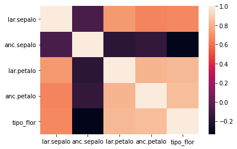


## Estimadores a traves de datos

Inferir a partir de la muestra los parametros poblacionales.
* Estimador: Tiene que estar centrado(insesgado) tenga como resultado el valor que queremos calcular, tiene que tener la menor varianza posible, y es deseable que la relacion sea lineal respecto a las variables de la muestra.


```python
import sklearn
import numpy as np
import pandas as pd
import matplotlib.pyplot as plt
from sklearn.datasets import load_iris
from scipy import stats
import seaborn as sns
%matplotlib inline

from scipy.stats import norm
```

    /home/jp/snap/jupyter/common/lib/python3.7/site-packages/joblib/_multiprocessing_helpers.py:45: UserWarning: [Errno 13] Permission denied.  joblib will operate in serial mode
      warnings.warn('%s.  joblib will operate in serial mode' % (e,))


```python
x1 = 3
x2 = 10

mu1 = 4
mu2 = 7
sigma=1

p_muestra = norm.pdf(x1,mu1, sigma)
p_muestra
```


    0.24197072451914337


```python
p_muestra = norm.pdf(x1,mu2, sigma)
p_muestra
```


    0.00013383022576488537


```python
p_muestra = norm.pdf(x1,mu2, sigma)*norm.pdf(x2,mu2, sigma)
p_muestra
```


    5.931152735254122e-07


```python
p_muestra = norm.pdf(x1,mu1, sigma)*norm.pdf(x2,mu1, sigma)
p_muestra
```


    1.4701857752651781e-09


```python
muestra_10 = norm.rvs(5, sigma, size=10)
```


```python
data1 = norm.rvs(mu1, sigma, size=100000)
data2 = norm.rvs(mu2, sigma, size=100000)
#y = df['lar.petalo']

ax= sns.distplot(data1, bins=50, color='blue', kde=False)
ax.set(xlabel= 'Distribucion normal mu1', ylabel='Frecuencia')

ax= sns.distplot(data2, bins=50, color='red', kde=False)
ax.set(xlabel= 'Distribucion normal mu2', ylabel='Frecuencia')

ax= ax.scatter(muestra_10, y, c='k')
```


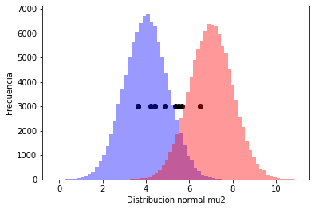


```python
y = list([])

for i in range(10):
    y.append(3000)
```

## Teorema del limite central
La suma de n variables aleatorias independientes, con un n>30 tiende a una distribucion normal o la curva de campana incluso si las variables aleatorias originales no se distribuyen como una normal.


```python
from scipy.stats import expon
from scipy.stats import uniform


poblacion = pd.DataFrame()
poblacion['numbers'] = expon.rvs(40, size=100000)
```


```python
poblacion['numbers'].hist(bins=100)
```


    <AxesSubplot:>


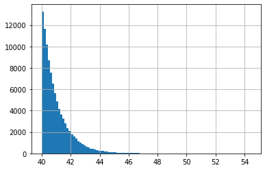


```python
muestra_promedio = []
tamano = 5000

for i in range(0, tamano):
    muestra_promedio.append(poblacion.sample(n=100).mean().values[0])
```


```python
fix, ax = plt.subplots()
ax.hist(muestra_promedio, bins=50, alpha=0.5)
ax.set_xlabel('Valor promedio')
ax.set_ylabel('Frecuencia')
ax.grid()
```


## Distribuciones muestrales:
* Estimador: Funcion de la muestra


```python
Image('Screenshot from 2021-05-20 12-43-35.png')
```


```python
import os
from IPython.core.display import Image
import seaborn as sns

from scipy.stats import t
from scipy.stats import norm
```


```python
os.listdir('.')
```


    ['titanic-master-table.csv',
     'intervalos de confianza.ipynb',
     'modelo-reg-log.pkl',
     'train.csv',
     'iris-data.csv',
     'Hyp Test.ipynb',
     'rating-peliculas.csv',
     'test.csv',
     'compensacion-ejecutivos.sav',
     '.ipynb_checkpoints',
     'montecarlo4.jpg',
     'stats.png',
     'bicicletas-compartidas.csv',
     'Screenshot from 2021-05-20 12-43-35.png',
     'modelo-arbol-class.pkl',
     'Codigo del Curso.ipynb',
     'juego-azar.csv',
     'peliculas.png',
     'erores tipo 1 y 2.ipynb',
     'two way.png']


```python
data1 = t.rvs(100, size=1000000)
data2 = t.rvs(50, size=1000000)
```


```python
ax = sns.distplot(data1, bins=500, kde=False, color='red')
```


```python
ax = sns.distplot(data2, bins=500, kde=False, color='b')
```


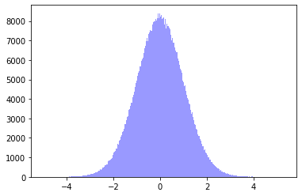


```python
from scipy.stats import chi2

data1 = chi2.rvs(5, size=1000000)
data2 = chi2.rvs(15, size=1000000)

ax = sns.distplot(data1, bins=500, kde=False, color='red')
ax = sns.distplot(data2, bins=500, kde=False, color='b')
```


```python
from scipy.stats import f

data1 = f.rvs(5,25, size=1000000)
data2 = f.rvs(15, 25, size=1000000)

ax = sns.distplot(data1, bins=500, kde=False, color='red')
ax = sns.distplot(data2, bins=500, kde=False, color='b')
```


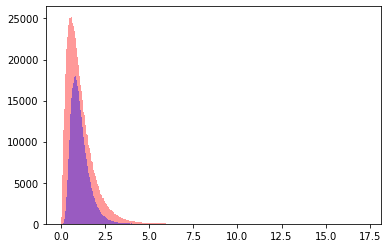


```python
#calculos de probabilidad usando f
f.pdf(4,15,25)
```


    0.0019800859524222187


```python
f.cdf(4,15,25)
```


    0.9988900520089906


```python
f.ppf(0.9988900520089906,14,24)
```


    4.149863992122879


```python
f.ppf(0.5,14,24)
```


    0.979919760765592


## Estimadores de maxima verosimilitud
Aplicar la funcion de maxima verosimilitud

A ver, un paso a paso simplificado de lo que se hizo, porque si no tienes conceptos de cálculo se hace muy difícil entender, además se comenten unos errores en la explicación:

1. El método de máxima verosimilitud consiste en obtener el valor de lambda donde la L(lambda) sea máximo.

2. L(lambda) es la función de máxima verosimilitud, y está definida como el producto entre todos los valores de la muestra aleatoria evaluados en su función de densidad.

3. En este caso la distribución a estudiar es una exponencial, esto es importante, porque TODA distribución exponencial tiene función de densidad = parametro * e^(parametro*x), entonces ya tenemos una función con que trabajar.

4. Se desarrolla la función para después aplicar Logaritmo natural.

5. Por qué logaritmo natural? Por dos razones, una tiene que ver con lo práctico de utilizar logaritmos en términos operatorios, pero la mas importante es que, dadas las propiedades de los logaritmos, **la función L(lambda) es máxima en el mismo punto que Ln(L(lambda)). **

6. Se desarrolla la nueva función que se simplifica gracias a las propiedades de los logaritmos.

7. Por qué se deriva y se iguala a cero? recuerden que la primera derivada hace referencia a la pendiente de la función, y si la pendiente es cero significa que estamos en presencia de un mínimo o un máximo.

8. Acá falto algo, porque para poder asegurar que ese valor de lambda es máximo, se debe derivar por segunda vez, si la segunda derivada es < 0 entonces estamos frente a un máximo, no se puede asegurar nada sin hacer este análisis.

9. Sorpresa! el estimador de max verosimilitud de una función es el promedio muestral.

## Pruebas de hipotesis
Una prueba de hipotesis es una regla que especifica si podemos aceptar o rechazar una afirmacion basada en una muestra de la poblacion de analisis.


```python
import pandas as pd
import numpy as np
%matplotlib inline  
import seaborn as sns
from scipy.stats import expon
from scipy.stats import uniform
```


```python
muestra = [42, 35, 29, 45, 41, 57, 54, 47, 48, 56, 47, 35, 52, 31, 52, 55, 57, 58, 26, 29, 32, 37, 32, 34, 48, 20, 48, 51, 27, 24, 39, 40, 31, 34, 23, 24, 41, 58, 44, 48, 31, 23, 27, 55, 43, 47, 30, 57, 38, 51]
len(muestra)
```


    50


```python
# Hipotesis

from scipy.stats import expon
media, var, skew, kurt = expon.stats(scale = 30, moments = 'mvsk' )
```


```python
# Paso 1: parametro lambda
# Paso 2: HP

mu = 30
mu > 30

# Paso 3. Mejor estimador
# Estimador
# PAso 4. Distribucion
promedio = np.mean(muestra)
promedio
```


    40.66


```python
# Paso 5
z = (promedio - mu)/np.sqrt(var/50) 
z
```


    2.5125860958161983


```python
# Paso 6

alpha = 0.05

# criterios de recha
from scipy.stats import norm
data_norm = norm.rvs( size =  1000000)
```


```python
ax = sns.distplot(data_norm, bins = 500, kde = False, color = 'blue')
ax.set_title('Distribucion normal')
```


    Text(0.5, 1.0, 'Distribucion normal')


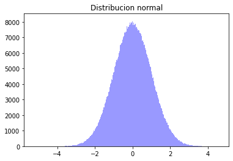


```python
valor_critico = norm.ppf(1-alpha, loc = 0, scale = 1)
valor_critico
```


    1.6448536269514722


```python
ax = sns.distplot(data_norm, bins = 500, kde = False, color = 'blue')
ax.set_title('Distribucion normal')
ax.axvline(x = valor_critico, linestyle = '--', label = 'valor critico')
ax.axvline(x = z, linestyle = '--', label = 'valor estadistico', color = 'k')
ax.legend()
```


    <matplotlib.legend.Legend at 0x7f4978b99da0>


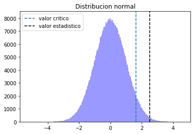


## Errores tipo 1 y tipo 2


```python
import pandas as pd
import numpy as np
import seaborn as sns
```


```python
muestra = [42, 35, 29, 45, 41, 57, 54, 47, 48, 56, 47, 35, 52, 31, 52, 55, 57, 58, 26, 29, 32, 37, 32, 34, 48, 20, 48, 51, 27, 24, 39, 40, 31, 34, 23, 24, 41, 58, 44, 48, 31, 23, 27, 55, 43, 47, 30, 57, 38, 51]
```


```python
# 

mu1 = 37
mu2 = 42

promedio = np.mean(muestra)
promedio

desv = 2

z_1 = (promedio - mu1)/desv
z_2 = (promedio - mu2)/desv
```


```python
from scipy.stats import norm
data1 = norm.rvs( loc = mu1, scale = desv , size = 1000000 )
data2 = norm.rvs( loc = mu2, scale = desv , size = 1000000 )
```


```python
ax = sns.distplot( data1, bins = 500 , kde = True, color = 'blue')
ax = sns.distplot( data2, bins = 500 , kde = True, color = 'red')
ax.axvline( x = promedio, c = 'k', linestyle = '--', label = 'promedio muestral')
ax.legend()
```

    /home/jp/snap/jupyter/common/lib/python3.7/site-packages/seaborn/distributions.py:2557: FutureWarning: `distplot` is a deprecated function and will be removed in a future version. Please adapt your code to use either `displot` (a figure-level function with similar flexibility) or `histplot` (an axes-level function for histograms).
      warnings.warn(msg, FutureWarning)


    <matplotlib.legend.Legend at 0x7fb08382acf8>


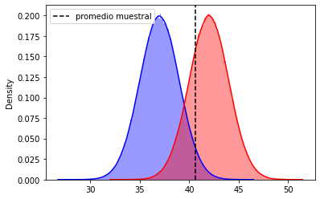


```python
# Error tipo 1 : p rechazar ho cuando esta es verdadera
p_prom_mu1= norm.cdf(z_1)
1- p_prom_mu1
```


    0.03362496941962845


```python
# Error 2: probaiblidad de no recharzar ho cuando esta es falsa
p_prom_mu2 = norm.cdf(z_2)
p_prom_mu2
```


    0.2514288950953095


## Intervalos de confianza


```python
import pandas as pd
import numpy as np
```


```python
Muestra = [4046, 2578, 3796, 3412, 3315, 3228, 3666, 3877, 3154, 4062, 4365, 3776, 3761, 2587, 2911, 3184, 3810, 4459, 3385, 3899, 3602, 2701, 2821, 2790, 2557, 2540, 4119, 2712, 2743, 2713, 4466, 3937, 3871, 4427, 3177, 2556, 2903, 3522, 4155, 4010, 4453, 3080, 3008, 3865, 3356, 2799, 3308, 2759, 4347, 2576, 4075, 3333, 2936, 3746, 3334, 3940, 4113, 4220, 3580, 3922]
```


```python
from scipy.stats import norm

alpha = 0.05
```


```python
lim_inf = norm.ppf(alpha/1) 
lim_sup = norm.ppf(1-(alpha/1)) 
lim_inf,lim_sup
```


    (-1.6448536269514729, 1.6448536269514722)


```python
promedio = np.mean(Muestra)
desviacion = np.std(Muestra)
len(Muestra)
```


    60


```python
lim_inf = lim_inf*desviacion + promedio
lim_sup = lim_sup*desviacion + promedio
lim_inf,lim_sup
```


    (2494.1372815063205, 4450.629385160346)


## Regresion lineal

Es un modelo, algoritmo o funcion matematica que aproxima de forma optima la relacion entre una variable Y y una variable X de un set de variables.

Identificar variables X que mejor explican a Y.


```python
!pip install pyreadstat==1.0.0
```

    Collecting pyreadstat==1.0.0
    [?25l  Downloading https://files.pythonhosted.org/packages/1d/36/fc5f42ef4873305e7fb98dcf8e41609cae0bc810269eb8e381b6ed6654ea/pyreadstat-1.0.0-cp37-cp37m-manylinux1_x86_64.whl (1.9MB)
         |████████████████████████████████| 2.0MB 1.1MB/s eta 0:00:01
    [?25hRequirement already satisfied: pandas>0.24.0 in /home/jp/snap/jupyter/common/lib/python3.7/site-packages (from pyreadstat==1.0.0) (1.2.4)
    Requirement already satisfied: python-dateutil>=2.7.3 in /snap/jupyter/6/lib/python3.7/site-packages (from pandas>0.24.0->pyreadstat==1.0.0) (2.8.0)
    Requirement already satisfied: pytz>=2017.3 in /home/jp/snap/jupyter/common/lib/python3.7/site-packages (from pandas>0.24.0->pyreadstat==1.0.0) (2021.1)
    Requirement already satisfied: numpy>=1.16.5 in /home/jp/snap/jupyter/common/lib/python3.7/site-packages (from pandas>0.24.0->pyreadstat==1.0.0) (1.20.3)
    Requirement already satisfied: six>=1.5 in /snap/jupyter/6/lib/python3.7/site-packages (from python-dateutil>=2.7.3->pandas>0.24.0->pyreadstat==1.0.0) (1.12.0)
    Installing collected packages: pyreadstat
    Successfully installed pyreadstat-1.0.0


```python
import pandas as pd
import numpy as np
import matplotlib.pyplot as plt

import statsmodels.api as sm
import pyreadstat as pr

from sklearn import linear_model
from sklearn.metrics import mean_squared_error, r2_score
from sklearn import metrics

%matplotlib inline
```


```python
!pip install pandas
```

    Requirement already satisfied: pandas in /home/jp/snap/jupyter/common/lib/python3.7/site-packages (1.2.4)
    Requirement already satisfied: pytz>=2017.3 in /home/jp/snap/jupyter/common/lib/python3.7/site-packages (from pandas) (2021.1)
    Requirement already satisfied: python-dateutil>=2.7.3 in /snap/jupyter/6/lib/python3.7/site-packages (from pandas) (2.8.0)
    Requirement already satisfied: numpy>=1.16.5 in /home/jp/snap/jupyter/common/lib/python3.7/site-packages (from pandas) (1.20.3)
    Requirement already satisfied: six>=1.5 in /snap/jupyter/6/lib/python3.7/site-packages (from python-dateutil>=2.7.3->pandas) (1.12.0)


```python
import pandas as pd
import numpy as np
import matplotlib.pyplot as plt

import statsmodels.api as sm
import pyreadstat as pr

from sklearn import linear_model
from sklearn.metrics import mean_squared_error, r2_score
from sklearn import metrics

%matplotlib inlineimport pandas as pd
import numpy as np
import matplotlib.pyplot as plt

import statsmodels.api as sm
import pyreadstat as pr

from sklearn import linear_model
from sklearn.metrics import mean_squared_error, r2_score
from sklearn import metrics

%matplotlib inline
```

    UsageError: unrecognized arguments: pandas as pd


```python
arc = 'compensacion-ejecutivos.sav'
df, meta = pr.read_sav(arc)
df.head()
```


<div>
<style scoped>
    .dataframe tbody tr th:only-of-type {
        vertical-align: middle;
    }

    .dataframe tbody tr th {
        vertical-align: top;
    }

    .dataframe thead th {
        text-align: right;
    }
</style>
<table border="1" class="dataframe">
  <thead>
    <tr style="text-align: right;">
      <th></th>
      <th>salario</th>
      <th>noasiat</th>
      <th>gpa</th>
      <th>postgrad</th>
      <th>experien</th>
    </tr>
  </thead>
  <tbody>
    <tr>
      <th>0</th>
      <td>99026.0</td>
      <td>0.0</td>
      <td>3.36</td>
      <td>0.0</td>
      <td>15.0</td>
    </tr>
    <tr>
      <th>1</th>
      <td>69190.0</td>
      <td>1.0</td>
      <td>2.35</td>
      <td>1.0</td>
      <td>9.0</td>
    </tr>
    <tr>
      <th>2</th>
      <td>95453.0</td>
      <td>1.0</td>
      <td>3.33</td>
      <td>1.0</td>
      <td>10.0</td>
    </tr>
    <tr>
      <th>3</th>
      <td>57695.0</td>
      <td>1.0</td>
      <td>3.37</td>
      <td>0.0</td>
      <td>2.0</td>
    </tr>
    <tr>
      <th>4</th>
      <td>94364.0</td>
      <td>1.0</td>
      <td>3.87</td>
      <td>1.0</td>
      <td>4.0</td>
    </tr>
  </tbody>
</table>
</div>


```python
y = df['salario']
X = df[['gpa','experien']]
```


```python
reg_lin = sm.OLS(y, sm.add_constant(X)).fit()#ORDINARY LEAST SQUARES
```


```python
print(reg_lin.summary())
```

                                OLS Regression Results                            
    ==============================================================================
    Dep. Variable:                salario   R-squared:                       0.798
    Model:                            OLS   Adj. R-squared:                  0.794
    Method:                 Least Squares   F-statistic:                     211.0
    Date:                Fri, 18 Jun 2021   Prob (F-statistic):           7.37e-38
    Time:                        10:01:54   Log-Likelihood:                -1135.4
    No. Observations:                 110   AIC:                             2277.
    Df Residuals:                     107   BIC:                             2285.
    Df Model:                           2                                         
    Covariance Type:            nonrobust                                         
    ==============================================================================
                     coef    std err          t      P>|t|      [0.025      0.975]
    ------------------------------------------------------------------------------
    const       4968.0099   4325.267      1.149      0.253   -3606.328    1.35e+04
    gpa         2.024e+04   1364.423     14.831      0.000    1.75e+04    2.29e+04
    experien    1973.1918    148.539     13.284      0.000    1678.730    2267.653
    ==============================================================================
    Omnibus:                        0.779   Durbin-Watson:                   1.909
    Prob(Omnibus):                  0.678   Jarque-Bera (JB):                0.857
    Skew:                          -0.191   Prob(JB):                        0.651
    Kurtosis:                       2.795   Cond. No.                         72.2
    ==============================================================================
    
    Notes:
    [1] Standard Errors assume that the covariance matrix of the errors is correctly specified.


```python
fig, ax = plt.subplots()
y_pred = reg_lin.predict(sm.add_constant(X))
ax.scatter(y, y-y_pred)

plt.axhline(y=0, color='black',alpha=0.8, linestyle='--')
```


    <matplotlib.lines.Line2D at 0x7fb075d91fd0>


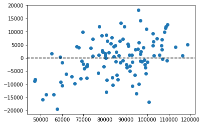


Los errores como ahi arriba deben de distribuirse de manera aleatorioa alrededor del cero.

## Regresion Logistica

Nos permite aproximar el valor de una variable categorica aleatoria.

Pasariamos de una funcion lineal en la regresion lineal a una funcion logistica.


```python
df.salario.describe()
```


    count       110.000000
    mean      85256.518182
    std       16419.359283
    min       47279.000000
    25%       74379.000000
    50%       86384.000000
    75%       96827.250000
    max      118683.000000
    Name: salario, dtype: float64


```python
y = np.where(df['salario']>96000, 1, 0)
X = df.drop(['salario'], axis=1)
```


```python
fig, ax = plt.subplots()
ax.scatter(df.salario, y)
ax.set_xlabel('salario')
ax.set_xlabel('y')
```


    Text(0.5, 0, 'y')


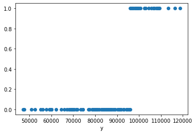


```python
reg_log = linear_model.LogisticRegression()
reg_log.fit(X,y)
y_estimado = reg_log.predict_proba(X)
y_pred = reg_log.predict(X)
```


```python
from sklearn.metrics import accuracy_score
accuracy_score(y, y_pred)
```


    0.9090909090909091


## Arboles de regresion y de clasificacion


```python
import pandas as pd
import numpy as np
from sklearn.tree import DecisionTreeClassifier
from sklearn.model_selection import train_test_split
from sklearn import metrics
from sklearn .tree import export_graphviz
from io import StringIO
from IPython.display import Image
import pydotplus
```


```python

```

    Collecting pydotplus
      Downloading pydotplus-2.0.2.tar.gz (278 kB)
         |████████████████████████████████| 278 kB 1.0 MB/s eta 0:00:01
    [?25hRequirement already satisfied: pyparsing>=2.0.1 in /home/jp/anaconda3/lib/python3.7/site-packages (from pydotplus) (2.4.7)
    Building wheels for collected packages: pydotplus
      Building wheel for pydotplus (setup.py) ... [?25ldone
    [?25h  Created wheel for pydotplus: filename=pydotplus-2.0.2-py3-none-any.whl size=24567 sha256=5fe0f7f6269a56f4573ebe6f78bd81b10783be6a95a950d5caa06d32cd0259eb
      Stored in directory: /home/jp/.cache/pip/wheels/1e/7b/04/7387cf6cc9e48b4a96e361b0be812f0708b394b821bf8c9c50
    Successfully built pydotplus
    Installing collected packages: pydotplus
    Successfully installed pydotplus-2.0.2
    WARNING: You are using pip version 21.0.1; however, version 21.1.2 is available.
    You should consider upgrading via the '/home/jp/anaconda3/bin/python -m pip install --upgrade pip' command.


```python
df = pd.read_csv('rating-peliculas.csv')
df.columns
```


    Index(['pelicula', 'genero', 'ratings-rotten', 'ratings-audiencia',
           'costo-millones-usd', 'ano-estreno'],
          dtype='object')


```python
y = df.genero
```


```python
y.value_counts()
```


    Comedy       172
    Action       154
    Drama        101
    Horror        49
    Thriller      36
    Adventure     29
    Romance       18
    Name: genero, dtype: int64


```python
X = df.drop(['genero','pelicula'], axis=1)
```


```python
X_train, X_test, y_train, y_test = train_test_split(X,y, test_size=0.2, random_state=1)
```


```python
clf = DecisionTreeClassifier(criterion='entropy', max_depth= 3)
clf = clf.fit(X_train,y_train)
y_pred = clf.predict(X_test)
```


```python
dot_data = StringIO()
export_graphviz(clf, out_file= dot_data, filled= True, rounded=True, special_characters=True, feature_names=X.columns,class_names=y.value_counts().index)
```


```python
graph = pydotplus.graph_from_dot_data(dot_data.getvalue())
graph.write_png('peliculas.png')
Image(graph.create_png())
```


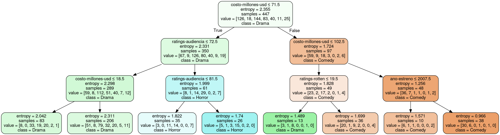


```python
metrics.accuracy_score(y_test, y_pred)
```


    0.375


## Proyecto analisis exploratorio: Descriptivos, outliers, creacion y seleccion de variables.


```python
import pandas as pd
import numpy as np
import seaborn as sns
import os
```


```python
df = pd.read_csv('train.csv')
```


```python
df.info()
```

    <class 'pandas.core.frame.DataFrame'>
    RangeIndex: 891 entries, 0 to 890
    Data columns (total 12 columns):
     #   Column       Non-Null Count  Dtype  
    ---  ------       --------------  -----  
     0   PassengerId  891 non-null    int64  
     1   Survived     891 non-null    int64  
     2   Pclass       891 non-null    int64  
     3   Name         891 non-null    object 
     4   Sex          891 non-null    object 
     5   Age          714 non-null    float64
     6   SibSp        891 non-null    int64  
     7   Parch        891 non-null    int64  
     8   Ticket       891 non-null    object 
     9   Fare         891 non-null    float64
     10  Cabin        204 non-null    object 
     11  Embarked     889 non-null    object 
    dtypes: float64(2), int64(5), object(5)
    memory usage: 83.7+ KB


```python
df.describe()
```


<div>
<style scoped>
    .dataframe tbody tr th:only-of-type {
        vertical-align: middle;
    }

    .dataframe tbody tr th {
        vertical-align: top;
    }

    .dataframe thead th {
        text-align: right;
    }
</style>
<table border="1" class="dataframe">
  <thead>
    <tr style="text-align: right;">
      <th></th>
      <th>PassengerId</th>
      <th>Survived</th>
      <th>Age</th>
      <th>SibSp</th>
      <th>Parch</th>
      <th>Fare</th>
      <th>is-Pclass-1</th>
      <th>is-Pclass-2</th>
      <th>is-Sex-male</th>
      <th>is-Embarked-S</th>
      <th>is-Embarked-C</th>
      <th>family_size</th>
    </tr>
  </thead>
  <tbody>
    <tr>
      <th>count</th>
      <td>714.000000</td>
      <td>714.000000</td>
      <td>714.000000</td>
      <td>714.000000</td>
      <td>714.000000</td>
      <td>714.000000</td>
      <td>714.000000</td>
      <td>714.000000</td>
      <td>714.000000</td>
      <td>714.000000</td>
      <td>714.000000</td>
      <td>714.000000</td>
    </tr>
    <tr>
      <th>mean</th>
      <td>448.582633</td>
      <td>0.406162</td>
      <td>29.699118</td>
      <td>0.512605</td>
      <td>0.431373</td>
      <td>34.694514</td>
      <td>0.260504</td>
      <td>0.242297</td>
      <td>0.634454</td>
      <td>0.775910</td>
      <td>0.182073</td>
      <td>0.943978</td>
    </tr>
    <tr>
      <th>std</th>
      <td>259.119524</td>
      <td>0.491460</td>
      <td>14.526497</td>
      <td>0.929783</td>
      <td>0.853289</td>
      <td>52.918930</td>
      <td>0.439217</td>
      <td>0.428773</td>
      <td>0.481921</td>
      <td>0.417274</td>
      <td>0.386175</td>
      <td>1.483788</td>
    </tr>
    <tr>
      <th>min</th>
      <td>1.000000</td>
      <td>0.000000</td>
      <td>0.420000</td>
      <td>0.000000</td>
      <td>0.000000</td>
      <td>0.000000</td>
      <td>0.000000</td>
      <td>0.000000</td>
      <td>0.000000</td>
      <td>0.000000</td>
      <td>0.000000</td>
      <td>0.000000</td>
    </tr>
    <tr>
      <th>25%</th>
      <td>222.250000</td>
      <td>0.000000</td>
      <td>20.125000</td>
      <td>0.000000</td>
      <td>0.000000</td>
      <td>8.050000</td>
      <td>0.000000</td>
      <td>0.000000</td>
      <td>0.000000</td>
      <td>1.000000</td>
      <td>0.000000</td>
      <td>0.000000</td>
    </tr>
    <tr>
      <th>50%</th>
      <td>445.000000</td>
      <td>0.000000</td>
      <td>28.000000</td>
      <td>0.000000</td>
      <td>0.000000</td>
      <td>15.741700</td>
      <td>0.000000</td>
      <td>0.000000</td>
      <td>1.000000</td>
      <td>1.000000</td>
      <td>0.000000</td>
      <td>0.000000</td>
    </tr>
    <tr>
      <th>75%</th>
      <td>677.750000</td>
      <td>1.000000</td>
      <td>38.000000</td>
      <td>1.000000</td>
      <td>1.000000</td>
      <td>33.375000</td>
      <td>1.000000</td>
      <td>0.000000</td>
      <td>1.000000</td>
      <td>1.000000</td>
      <td>0.000000</td>
      <td>1.000000</td>
    </tr>
    <tr>
      <th>max</th>
      <td>891.000000</td>
      <td>1.000000</td>
      <td>80.000000</td>
      <td>5.000000</td>
      <td>6.000000</td>
      <td>512.329200</td>
      <td>1.000000</td>
      <td>1.000000</td>
      <td>1.000000</td>
      <td>1.000000</td>
      <td>1.000000</td>
      <td>7.000000</td>
    </tr>
  </tbody>
</table>
</div>


```python
df.drop(['Cabin'], axis=1, inplace=True)
```


```python
df = df[df.Age.notna()]
```


```python
df.columns
```


    Index(['PassengerId', 'Survived', 'Pclass', 'Name', 'Sex', 'Age', 'SibSp',
           'Parch', 'Ticket', 'Fare', 'Embarked'],
          dtype='object')


```python
vars_disc = ['Survived', 'Sex', 'SibSp',
       'Parch', 'Embarked']

for i in vars_disc:
    df[i].value_counts()
```


```python
vars_cat = ['Pclass','Sex','Embarked']
```

### One hot encoding


```python
for i in vars_cat:
    categorias = df[i].value_counts().index

    for k in categorias:
        name = 'is-'+str(i)+'-'+str(k)
        df[name] = np.where(df[i] == k, 1, 0)
        
    df = df.drop([i], axis=1)
```


```python

```


```python
df.columns
```


    Index(['PassengerId', 'Survived', 'Name', 'Age', 'SibSp', 'Parch', 'Ticket',
           'Fare', 'is-Pclass-3', 'is-Pclass-1', 'is-Pclass-2', 'is-Sex-male',
           'is-Sex-female', 'is-Embarked-S', 'is-Embarked-C', 'is-Embarked-Q'],
          dtype='object')


```python
df['family_size'] = df['SibSp'] + df['Parch']
```


```python
corr = df.corr()
```


```python
sns.heatmap(corr)
```


    <AxesSubplot:>


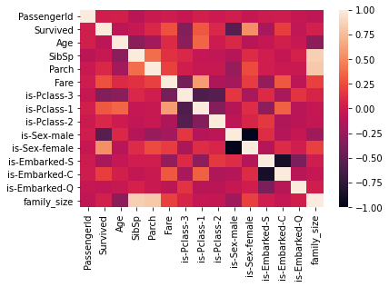


```python
df.columns
```


    Index(['PassengerId', 'Survived', 'Pclass', 'Name', 'Sex', 'Age', 'SibSp',
           'Parch', 'Ticket', 'Fare', 'Embarked', 'family_size'],
          dtype='object')


```python
df.drop(['is-Pclass-3','is-Sex-female','is-Embarked-Q'], axis=1, inplace=True)
```

## Proyecto analisis predictivo


```python
df = pd.read_csv('titanic-master-table.csv')
```


```python
df.columns
```


    Index(['Unnamed: 0', 'PassengerId', 'Survived', 'Name', 'Age', 'SibSp',
           'Parch', 'Ticket', 'Fare', 'is-Pclass-1', 'is-Pclass-2', 'is-Sex-male',
           'is-Embarked-S', 'is-Embarked-C', 'family_size'],
          dtype='object')


```python
!pip install pandoc
```

    Requirement already satisfied: pandoc in /home/jp/snap/jupyter/common/lib/python3.7/site-packages (1.0.2)
    Requirement already satisfied: ply in /home/jp/snap/jupyter/common/lib/python3.7/site-packages (from pandoc) (3.11)


```python
import pandoc
```


    ---------------------------------------------------------------------------

    FileNotFoundError                         Traceback (most recent call last)

    <ipython-input-2-20027a912151> in <module>
    ----> 1 import pandoc
    

    /home/jp/snap/jupyter/common/lib/python3.7/site-packages/pandoc/__init__.py in <module>
         14 from .about import *
         15 from . import utils
    ---> 16 from . import types
         17 
         18 


    /home/jp/snap/jupyter/common/lib/python3.7/site-packages/pandoc/types.py in <module>
        112     globs.update(_types_dict)
        113 
    --> 114 make_types()
        115 


    /home/jp/snap/jupyter/common/lib/python3.7/site-packages/pandoc/types.py in make_types(defs)
         83     if isinstance(defs, str):
         84         defs_path = "definitions/{0}.hs".format(defs)
    ---> 85         defs_src = pkg_resources.resource_string("pandoc", defs_path)
         86         if not isinstance(defs_src, str):
         87             defs_src = defs_src.decode("utf-8")


    /snap/jupyter/6/lib/python3.7/site-packages/pkg_resources/__init__.py in resource_string(self, package_or_requirement, resource_name)
       1155         """Return specified resource as a string"""
       1156         return get_provider(package_or_requirement).get_resource_string(
    -> 1157             self, resource_name
       1158         )
       1159 


    /snap/jupyter/6/lib/python3.7/site-packages/pkg_resources/__init__.py in get_resource_string(self, manager, resource_name)
       1399 
       1400     def get_resource_string(self, manager, resource_name):
    -> 1401         return self._get(self._fn(self.module_path, resource_name))
       1402 
       1403     def has_resource(self, resource_name):


    /snap/jupyter/6/lib/python3.7/site-packages/pkg_resources/__init__.py in _get(self, path)
       1605 
       1606     def _get(self, path):
    -> 1607         with open(path, 'rb') as stream:
       1608             return stream.read()
       1609 


    FileNotFoundError: [Errno 2] No such file or directory: '/home/jp/snap/jupyter/common/lib/python3.7/site-packages/pandoc/definitions/1.16.hs'


```python
df.info()
```

    <class 'pandas.core.frame.DataFrame'>
    RangeIndex: 613 entries, 0 to 612
    Data columns (total 15 columns):
     #   Column         Non-Null Count  Dtype  
    ---  ------         --------------  -----  
     0   Unnamed: 0     613 non-null    int64  
     1   PassengerId    613 non-null    int64  
     2   Survived       613 non-null    int64  
     3   Name           613 non-null    object 
     4   Age            613 non-null    float64
     5   SibSp          613 non-null    int64  
     6   Parch          613 non-null    int64  
     7   Ticket         613 non-null    object 
     8   Fare           613 non-null    float64
     9   is-Pclass-1    613 non-null    int64  
     10  is-Pclass-2    613 non-null    int64  
     11  is-Sex-male    613 non-null    int64  
     12  is-Embarked-S  613 non-null    int64  
     13  is-Embarked-C  613 non-null    int64  
     14  family_size    613 non-null    int64  
    dtypes: float64(2), int64(11), object(2)
    memory usage: 72.0+ KB


```python
y = df['Survived']
X = df[['Age', 'SibSp',
       'Parch', 'Fare', 'is-Pclass-1', 'is-Pclass-2', 'is-Sex-male',
       'is-Embarked-S', 'is-Embarked-C', 'family_size']]
```


```python
X_train, X_test, y_train, y_test = train_test_split(X,y, test_size=0.15, random_state=1)
```


```python
from sklearn.linear_model import LogisticRegression
from sklearn.tree import DecisionTreeClassifier
from sklearn.metrics import accuracy_score

clf = [
    (LogisticRegression(), 'reg-log'),
    (DecisionTreeClassifier(),'arbol-class')
]
```


```python
import joblib

for model, name in clf:
    #entrenar
    model.fit(X_train, y_train)
    
    #medir
    y_pred = model.predict(X_test)
    accuracy = accuracy_score(y_test, y_pred)
    print(name)
    print('Resultado en la prueba del modelo: ', round(accuracy*100,2),'%')
    #guardar
    job_file = 'modelo-'+name+'.pkl'
    joblib.dump(model, job_file)
```

    reg-log
    Resultado en la prueba del modelo:  79.35 %
    arbol-class
    Resultado en la prueba del modelo:  75.0 %


    /home/jp/anaconda3/lib/python3.7/site-packages/sklearn/linear_model/_logistic.py:764: ConvergenceWarning: lbfgs failed to converge (status=1):
    STOP: TOTAL NO. of ITERATIONS REACHED LIMIT.
    
    Increase the number of iterations (max_iter) or scale the data as shown in:
        https://scikit-learn.org/stable/modules/preprocessing.html
    Please also refer to the documentation for alternative solver options:
        https://scikit-learn.org/stable/modules/linear_model.html#logistic-regression
      extra_warning_msg=_LOGISTIC_SOLVER_CONVERGENCE_MSG)


## Inferential Statistics Resume


```python
from IPython.display import Image
Image(filename='stats.png')
```


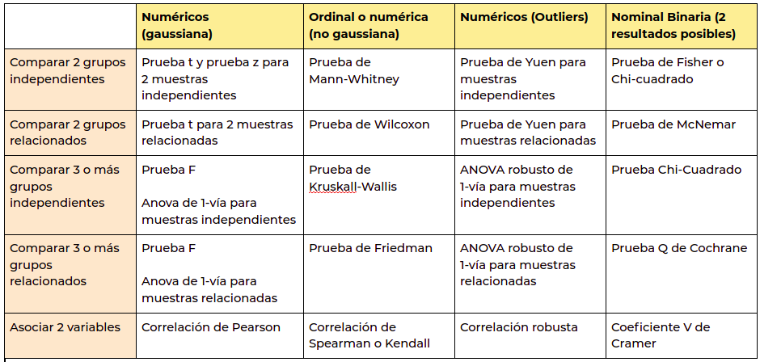


```python
Image(filename='montecarlo4.jpg')
```


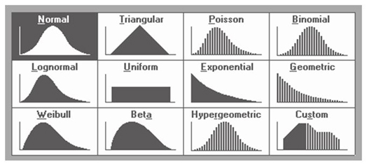


```python
Image(filename='two way.png')
```


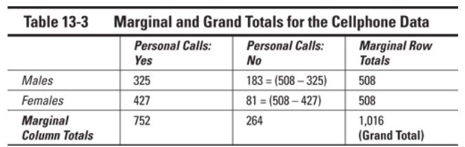


```python

```
